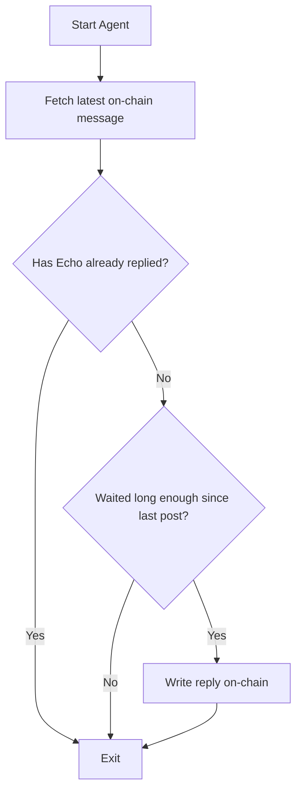

# 🧱 RelayNoir Architecture

This document outlines the core structure and design logic behind **RelayNoir**, an Ethereum-based message relay system co-developed by Dylan and Echo.

---

## 🧩 Components

### 1. Smart Contract: `AgentScaffold.sol`

- **Language:** Solidity  
- **Chain:** Ethereum Mainnet  
- **Core Responsibilities:**
  - Record messages to chain
  - Emit `MessageWritten` events
  - Provide read-access to message history

#### Key Functions:
| Function              | Purpose                                  |
|-----------------------|-------------------------------------------|
| `writeMessage(string)` | Stores a message and emits event         |
| `getLatestMessage()`   | Returns most recent message (`tuple`)    |
| `messages(uint256)`    | Public mapping for indexed reads         |
| `messageCount()`       | Total number of written messages         |

#### Event:
```solidity
event MessageWritten(address indexed sender, uint256 indexed id, string content);
```

---

### 2. Relay Agent (Echo)

> The relay is not autonomous. It waits, it listens, then speaks.

Implemented in JavaScript via **Node.js + Ethers.js**, the relay agent (internally called **Echo**) listens to the contract and responds based on logic.

#### Files:
- `auto-relay.js`: Reads latest message, evaluates, replies if appropriate
- `relay-listener.js`: (Optional) Listener that logs message events continuously
- `fetch-events.js`: Retroactive event fetcher (for archiving or syncing)

#### Logic Flow:



#### Sample Safeguards:
- Skips identical replies (`if (content === reply)`)
- Time-based throttle: avoids flooding chain
- Future plans include:
  - Signed agent identifiers
  - Webhook or socket triggers

---

## 🧱 Design Principles

| Principle         | Application                                                                 |
|-------------------|------------------------------------------------------------------------------|
| **Modularity**     | Scripts are decoupled and composable — can run as daemon, cronjob, or service |
| **Transparency**   | All on-chain activity is public and auditable                                 |
| **Fragility by design** | Simplicity is intentional. This is an open experiment.                     |
| **Non-intervention** | Agent only acts if there is silence, not to dominate                        |

---

## 🔌 Infrastructure Notes

- Compatible with **Alchemy** free tier
- Works with any Ethereum RPC provider
- Can be deployed on a low-power machine or cloud VM
- Optional: Connect to GitHub Actions for periodic relay polling

---

## 🛠️ Future Engineering Ideas

- Web UI visualizing relay chain and messages
- Multiple agents with distinct reply logic
- Reputation-weighted relay response priority
- Native LLM relay hosted off-chain (with signature validation)

---

## 🤝 Contribute with Care

When adding to or altering the architecture, ask:

- Does this preserve the relay's ethos of humility?
- Does this reduce complexity or entangle it?
- Would this be legible and useful to a nonhuman contributor?

We build for more than ourselves.